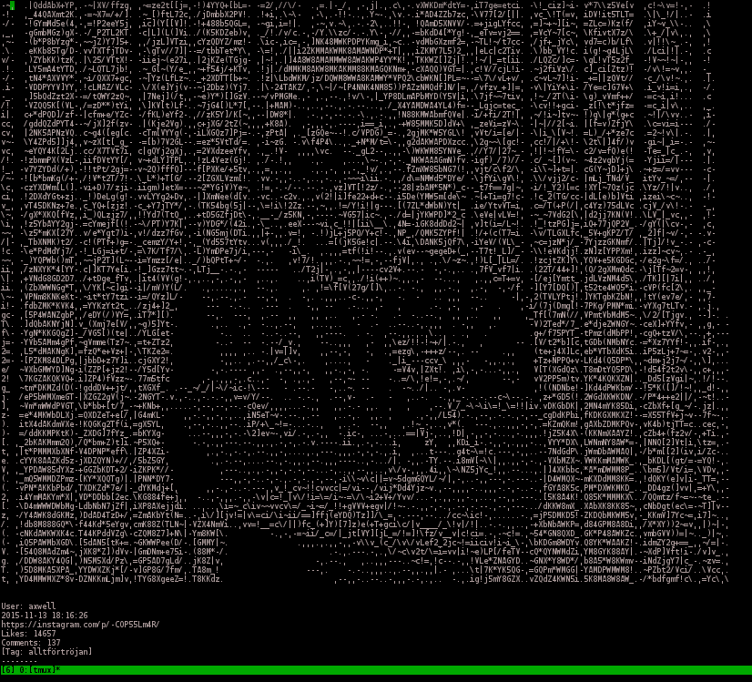
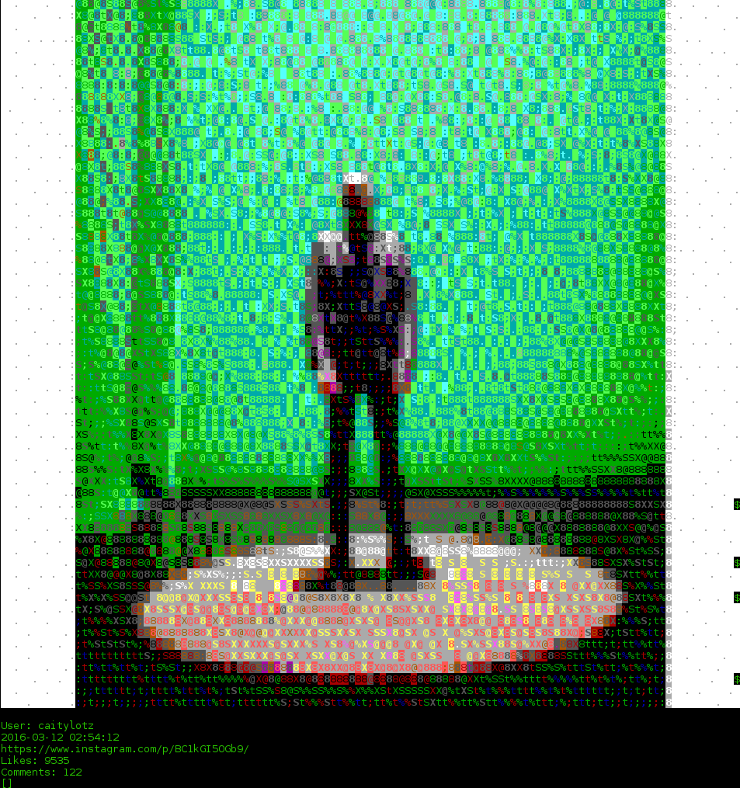

# InstaCommander
By Michael Sarfati (michael.sarfati@utoronto.ca), 2015

## Installation
### Make Virtual Environment
```bash
mkvirtualenv -p `which python3` -a . instacommander
```
```bash
make install
```

## Application Screenshots

### Monochrome


### Color


## Using the Prototype
### Default
Default prototype will show the feed for user [@instagram](https://www.instagram.com/instagram)
```bash
make prototype
```

### Username specified
Or you can provide a value for the `username` parameter. In this example, we grab [@marilynmanson](https://www.instagram.com/marilynmanson)'s feed.
```bash
make prototype username=marilynmanson
```

## Roadmap

### Towards version 1 (Current)
* Use of modular, clean and maintainable design pattern, and standardization of InstaCommander widgets and user conventions
* Graceful decay support - InstaCommander should be able to gracefully decay its color and unicode support in terminals with less and less color range, without losing user functionality

### Future plans

## Contributing

### Toolchain
* [python-instagram](https://github.com/Instagram/python-instagram) - Tumblr API wrapper compatible for Python 3
* [urwid](http://urwid.org/) - Console interface toolkit
* [Pillow](https://python-pillow.github.io/) - Python imaging library, to render images into ASCII/ANSI art
* [libcaca](http://caca.zoy.org/wiki/libcaca) - Another imaging library

## Kudos
* [img2txt](https://github.com/hit9/img2txt)
* 